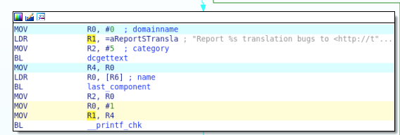

#### Data dependency plugin.

Statements for which you want to the data dependencies are colored in yellow.
The addresses of these statements should be put in a file (see `in.txt` for an
example) and then passed to the plugin (see `run.sh`). The statements (data
dependencies themselves) are colored in blue.

Here is an example:

The `in.txt` file can be automatically generated with the example `arg-finder`
plugin.  For example, you might want to highlight data dependencies of
arguments to certain functions.

The `in.txt` file for the above example was produced by running the arg-finder
plugin on `bin/coreutils_O1_cat` for "fortified" functions such as
`__printf_chk`

##### Notes

This dependenc relies on a dataflow framework which generates reaching
definitions. From these reaching definitions data dependencies are calculatted
using use-def changs.

There are two ways to emit ida scripts. One is to use
`--data_deps-idascript=script.py`. The other is `--emit-ida-script=scripty.py`.
The latter does not preserve the order in which addresses are added to the
`Memmap` structure, so both options are kept. I prefer knowing the order in
which I added the addresses to be highlighted.
